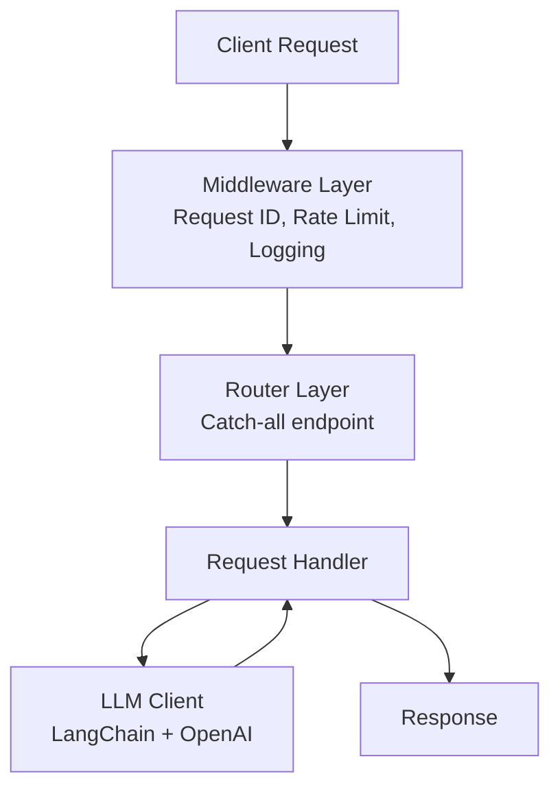

# Contributing to Chaos API

Thank you for your interest in contributing to Chaos API! This document provides guidelines and instructions for contributing.

## Development Setup

### Prerequisites

- Python 3.10+
- Poetry 1.8+
- Docker (optional, for containerized development)

### Local Development

1. **Clone the repository**
   ```bash
   git clone https://github.com/johnsosoka/chaos-api.git
   cd chaos-api
   ```

2. **Install dependencies**
   ```bash
   poetry install
   ```

3. **Set up environment variables**
   ```bash
   cp .env.example .env
   # Edit .env and add your OpenAI API key
   ```

4. **Run the development server**
   ```bash
   poetry run uvicorn src.chaos_api.main:app --reload --port 8000
   ```

### Using Docker

```bash
# Production build
docker-compose up chaos-api

# Development with hot reload
docker-compose --profile dev up chaos-api-dev
```

## Code Quality

We use several tools to maintain code quality:

### Linting and Formatting

```bash
# Run linter
poetry run ruff check src/ tests/

# Fix auto-fixable issues
poetry run ruff check --fix src/ tests/

# Format code
poetry run ruff format src/ tests/
```

### Type Checking

```bash
poetry run mypy src/
```

### Testing

```bash
# Run all tests
poetry run pytest tests/ -v

# Run with coverage
poetry run pytest tests/ --cov=src/chaos_api --cov-report=term-missing
```

### Pre-commit Hooks

Install pre-commit hooks to run checks automatically:

```bash
poetry run pre-commit install
```

## Project Structure

```
chaos-api/
├── src/chaos_api/          # Main application code
│   ├── __init__.py
│   ├── main.py             # FastAPI application
│   ├── config.py           # Pydantic settings
│   ├── llm_client.py       # LangChain LLM wrapper
│   ├── mime_handlers.py    # MIME type detection
│   ├── prompt_builder.py   # LLM prompt construction
│   ├── middleware.py       # Request middleware
│   └── routes.py           # Health/metrics endpoints
├── tests/                  # Test suite
├── .github/workflows/      # CI/CD configuration
├── Dockerfile              # Production Docker image
├── Dockerfile.dev          # Development Docker image
├── docker-compose.yml      # Docker Compose configuration
├── pyproject.toml          # Poetry dependencies and tool config
└── README.md               # Project documentation
```

## Making Changes

1. **Create a branch**
   ```bash
   git checkout -b feature/your-feature-name
   ```

2. **Make your changes**
   - Follow existing code style
   - Add tests for new functionality
   - Update documentation as needed

3. **Run quality checks**
   ```bash
   poetry run ruff check src/ tests/
   poetry run mypy src/
   poetry run pytest tests/
   ```

4. **Commit your changes**
   ```bash
   git add .
   git commit -m "Add feature: description"
   ```

5. **Push and create a pull request**
   ```bash
   git push origin feature/your-feature-name
   ```

## Testing Guidelines

- Write tests for all new functionality
- Aim for 80%+ code coverage
- Use descriptive test names that explain what is being tested
- Mock external dependencies (LLM calls, etc.)
- Test both success and error cases

## Architecture

The application follows a layered architecture:



### Key Components

- **Middleware**: Request ID tracing, rate limiting, logging
- **MIME Handlers**: Content negotiation and request body parsing
- **Prompt Builder**: Constructs LLM prompts from request context
- **LLM Client**: Wraps LangChain for API response generation

## Release Process

1. Update version in `pyproject.toml`
2. Update `CHANGELOG.md` with release notes
3. Create a git tag: `git tag v0.x.x`
4. Push tag: `git push origin v0.x.x`
5. GitHub Actions will build and publish the Docker image

## Code of Conduct

- Be respectful and constructive
- Focus on what is best for the community
- Welcome newcomers and help them learn

## Questions?

Open an issue for:
- Bug reports
- Feature requests
- Documentation improvements
- General questions

Thank you for contributing!
